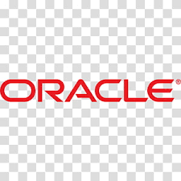

### ⭐ &nbsp;Little about me :
- 👋 Hi, I’m Keerthana Allam, a data analysis enthusiast currently pursuing a master's in Data Science at the University at Buffalo.

- 👀 I’m interested in leveraging my skills in data analysis, Power Platforms, SQL, Python, and machine learning to solve complex problems and derive actionable insights from data.

- 🌱 I’m currently learning and exploring advanced techniques in data science to stay at the forefront of the rapidly evolving field.

- 💞️ I’m looking to collaborate on data-driven projects that require expertise in Power BI, SQL, Python, and predictive analysis. I'm enthusiastic about contributing to informed decision-making through insightful 
     data analysis.

- 📫 How to reach me: Connect with me on [LinkedIn](www.linkedin.com/in/keerthanaallam) or send me an email at kallam@buffao.edu. I'm open to exploring opportunities for data projects and collaborations!
### Find me at:

&nbsp;

### 🛠 &nbsp;Languages and Tools :

&nbsp;
&nbsp;
&nbsp;
&nbsp;
&nbsp;
 &nbsp;
&nbsp;
&nbsp;
&nbsp;
&nbsp;
&nbsp;
&nbsp;
&nbsp;
&nbsp;

 

<!-- -->
---

<!---
Keerthana-Allam/Keerthana-Allam is a ✨ special ✨ repository because its `README.md` (this file) appears on your GitHub profile.
You can click the Preview link to take a look at your changes.
--->
